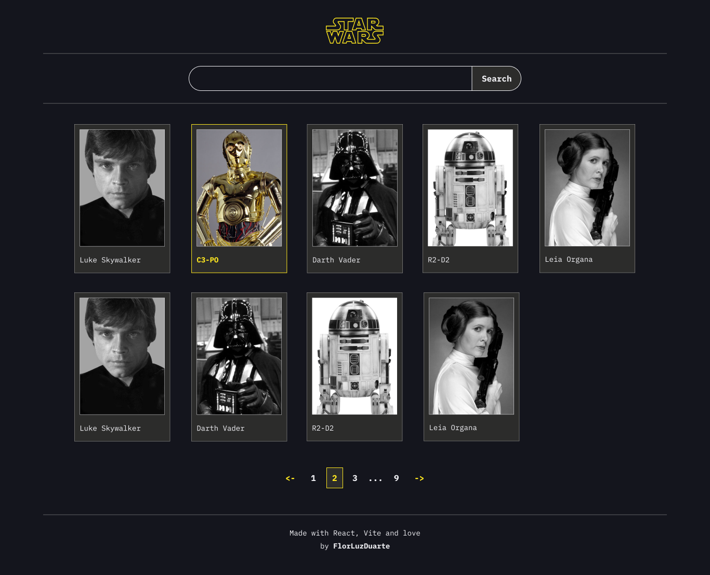

# Star Wars PWA

## ✍️ Descripción del proyecto

Para este test técnico se solicitaron los siguientes requerimientos:

👉️ **Objetivo**: Diseñar y desarrollar un visor de tarjetas de héroes de Star Wars utilizando React y convertirlo en una PWA.

👉️ **Requisitos**:

 1. Utiliza la SWAPI (The Star Wars API) para obtener información sobre los personajes de Star Wars.   
 2. Diseña las tarjetas de héroes utilizando componentes de React.  
 3. Cada tarjeta debe mostrar información relevante, como el nombre, la imagen del personaje y otros detalles interesantes.  
 4. Implementa una función para cargar los datos de la API y renderizar las tarjetas dinámicamente.  
 5. Convierte la aplicación en una PWA para que funcione offline, para ello debes permitir almacenar información en caso de que la app se encuentre offline  y se pueda instalar en dispositivos móviles y escritorio.  

👉️ **Bono**:

 1. Agrega animaciones o transiciones para mejorar la experiencia del usuario.  
 2. Implementa una funcionalidad de búsqueda o filtrado de personajes.  

## 🚀 Deploy

Pueden visitar la app desde: https://star-wars-pwa.netlify.app/

⚠️ IMPORTANTE: Para probar su funcionamiento offline realizar los siguientes pasos:
1. Esperar a que figure en pantalla la notificación que avisa "App lista para funcionar offline"
2. Una vez vista la notificación recargar una vez más la página (con conexión)
3. Ya se puede probar offline. Configurando la navegación sin conexión desde devtools/network/offline

## ⚙️  Stack utilizado

- **Vite** --> Para iniciar el proyecto y generar los builds (Bundling)  
- **React + TypeScript** --> Como herramientas principales (framework + lenguaje)  
- **React-Router-Dom** --> Para el routing  
- **Emotion + Styled** --> Para los estilos   
- **VitePWA** --> Plugin que encapsula las herramientas necesarias para trabajar con PWAs en el entorno de Vite. De fondo utiliza **Workbox** como principal dependencia para el trabajo con Service Workers.  
- **Figma** --> Para los diseños de referencia  
- **SWAPI API** --> Para la obtención de la data de Star Wars  

## 🏛️ Arquitectura del proyecto

### 1. Estructura de carpetas

Dentro del proyecto se encuentran las siguientes carpetas con su correspondiente uso:

- **/public** 
- **/src**  
	- **/components** --> Para almacenar todos los componentes utilizados en la app.  Seguí  una estrategia de división de componentes basada en atomic design. Los elementos más primitivos de la  UI (atoms), se encuentran en la carpeta /ui. Estos sirven de base para generar los componentes  intermedios (molecules) que están asociados a una funcionalidad concreta  (search, pagination, layout, characters y api-states)  
    - /api-states
		- /characters  
		- /layout  
		- /pagination   
		- /search   
		- /ui  
	- **/context** --> Contexto de la app   
	- **/hooks** --> Custom hooks 
		- /swapi-api   
		- /usStarWarsContext    
	- **/models** -->  Para los tipados compartidos entre elementos  
	- **/pages** --> Páginas de la app  
	- **/services** --> Para funciones que manejan las peticiones a la API 
	- **/styles** --> Para estilos generales   
	- **/utils** --> Para funciones auxiliares   
	- sw.ts --> Lógica para el funcionamiento del service worker  
- vite.config.ts --> Configuraciones de Vite + Configuraciones de VitePWA que impactan en la generación del manifest necesario para la PWA  

### 2. Capas del contexto

- **Services** --> Contiene las funciones para interactuar con las APIs   
- **Hooks/swapi-api** --> Por cada tipo de dato se genera uno. Utilizan los servicios y se encargan de gestionar los estados de: loading, data y errors  
- **Context** --> Disponibiliza los estados de los custom hooks para ser utilizados por toda la app  

En este gráfico se puede ver cómo es la relación entre las partes del context junto con las APIs: https://drive.google.com/file/d/15bMiuOcUPKEsC8lIUkH1PfCnxRSsrqbl/view?usp=sharing

## 🖍️ Diseños

Para poder realizar el proyecto, armé un pequeño diseño de referencia con las pantallas principales. Se puede ver desde este link: https://www.figma.com/design/iElCCyatxiMdajUFL2KvTE/test-frontend-emergencias?node-id=0-1&t=2TSbIarjEaubzQ51-1
(Varias modificaciones se realizaron directamente en código, el diseño sólo lo usé como base y para graficar ideas).  

## 🚀 Pasos para levantar el proyecto

1. `git clone <repo>` clonar este repositorio para poder visualizarlo localmente
2. `npm install` para regenerar los Node Modules de las dependencias   
3. `npm run dev` para visualizar el proyecto en desarrollo   
4. `npm run build` para ver el build de producción y poder chequear el funcionamiento del service worker (solamente se puede acceder a su comportamiento desde el build)  
5. `npm run preview` para poder levantar el proyecto en modo producción  

## ⏳️ Pendientes (TO-DOs)

1. Implementar testing para los componentes y funcionalidades principales.  
2. Mejorar la estructura de los servicios y custom hooks asociados ya que son muy verbosos y hay bastante espacio para mejorar estas partes de la app.  
3. Agregar transiciones entre pages para una mejor experiencia del usuario.  
4. Cambiar los estilos globales que están en index.css por una implementación con Emotion + Styled

## ✅ Mejoras potenciales 

1. Revisar más detalladamente la accesibilidad de los componentes y aplicar mejoras necesarias.  
2. Probar el uso de indexedDB para ofrecer una solución off-line que replique la estructura de la base de datos original. 
3. Contemplar desde el diseño y la implementación del front-end que hay muchos más tamaños de pantalla disponibles para una PWA que los que hay para una web, ya que sobre todo en desktop el tamaño de la ventana no guarda la típica relación mobile/tablet/desktop que más habitual.

## 🧞 Scripts 

`npm run dev` --> Para inicializar el servidor en desarrollo  
`npm run build` --> Para generar el build de producción  
`npm run preview` --> Para levantar el proyecto una vez realizado el build  
